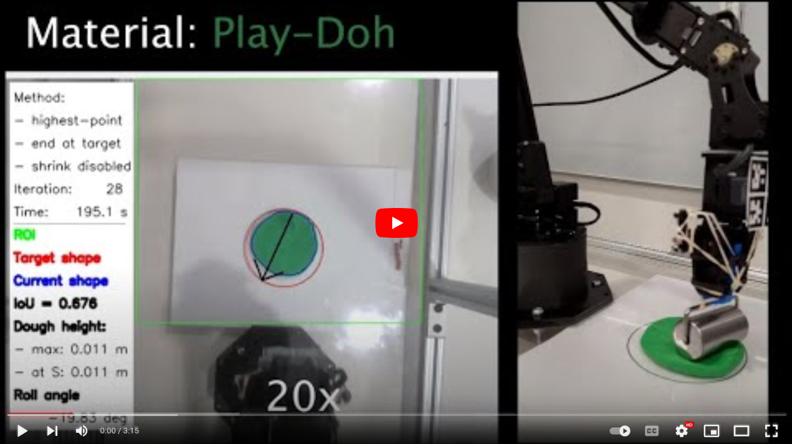

# Robotic Dough Shaping


## About


We address the problem of shaping a piece of dough-like deformable material into a 2D target shape presented upfront. We use a 6 degree-of-freedom WidowX-250 Robot Arm equipped with a rolling pin and information collected from an RGB-D camera and a tactile sensor.

We present and compare several control policies, including a dough shrinking action, in extensive experiments across three kinds of deformable materials and across three target dough shapes, achieving the intersection over union (IoU) of 0.90. 

Our results show that: i) rolling dough from the highest dough point is more efficient than from the 2D/3D dough centroid; ii) it might be better to stop the roll movement at the current dough boundary as opposed to the target shape outline; iii) the shrink action might be beneficial only if properly tuned with respect to the expand action; and iv) the Play-Doh material is easier to shape to a target shape as compared to Plasticine or Kinetic sand.

The full paper is available at ...

<p align="right">(<a href="#top">back to top</a>)</p>


## Video Demo


[](https://youtu.be/ZzLMxuITdt4)

<!-- If you want to use the YouTube thumbnail
[](https://youtu.be/ZzLMxuITdt4)
 -->


<p align="right">(<a href="#top">back to top</a>)</p>


## Getting Started

First, set up an interbotix workspace `interbotix_ws` with [interbotix_ros_manipulators](https://github.com/Interbotix/interbotix_ros_manipulators), [interbotix_ros_core](https://github.com/Interbotix/interbotix_ros_core), and [interbotix_ros_toolboxes](https://github.com/Interbotix/interbotix_ros_toolboxes) repositories.

Tune your camera-to-robot frame transformation and point cloud filter parameters. The [configs](./configs/) folder contains *our* configurations.

- camera-to-robot frame transformation from `interbotix_ros_manipulators/interbotix_ros_xsarms/interbotix_xsarm_perception/launch/xsarm_perception.launch` in the interbotix_ros_manipulators repo

- point cloud filter parameters from `interbotix_ros_manipulators/interbotix_ros_xsarms/interbotix_xsarm_perception/config/filter_params.yaml` in the interbotix_ros_manipulators repo


To run the Roll Dough GUI Application:

1. In one terminal run
    ```
    source ~/interbotix_ws/devel/source.bash
    roslaunch interbotix_xsarm_perception xsarm_perception.launch robot_model:=wx250s use_pointcloud_tuner_gui:=true
    ```

2. Clone this repo
    ```
    git clone https://github.com/jancio/Robotic-Dough-Shaping.git
    ```

3. In another terminal run
    ```
    cd <directory-roll_dough.py-file-is-located-in>
    python3 roll_dough.py -dr -vo -vw -m play-doh -sm highest-point -em target
    ```

4. See [roll_dough.py](./roll_dough.py) for all the command line options.

The code for force sensing is located in the [force-sensing](./force-sensing/) folder.


<p align="right">(<a href="#top">back to top</a>)</p>


## Experiments


We performed the following experiments across

- three target shapes ($T_{3.5}$ , $T_{4.0}$ , $T_{4.5}$) and

- three materials (*Play-Doh*, *Plasticine*, *Kinetic sand*)

to evaluate 
- roll start point methods (*Centroid-2D*, *Centroid-3D*, *Highest-Point*), 
- roll end point methods (*Target*, *Current*), and
- shrink action variants (*Shrink-Disabled*, *Forward-Shrink*, *Side-Shrink*).

We ran each experiment $N=3$ times and set the maximum time limit $T_{max} = 5$ min for each run.

<details>
  <summary>1. Performance across materials</summary>

- Settings
    - Target shape: $T_{4.0}$ (4 inch diameter)
    
    - Material: *Play-Doh*, *Plasticine*, *Kinetic sand*
    - Roll start point method: *Centroid-2D*, *Centroid-3D*, *Highest-Point*
    - Roll end point method: *Target*
    - Shrink action variant: *Shrink-Disabled*
- Experiment 1 in video demo
- Experiment A in paper
- Logs: ./logs/exp01/
</details>

<details>
  <summary>2. Roll start point methods</summary>

- Settings
    - Target shape: $T_{4.0}$ (4 inch diameter)
    
    - Material: *Play-Doh*, *Plasticine*, *Kinetic sand*
    - Roll start point method: *Centroid-2D*, *Centroid-3D*, *Highest-Point*
    - Roll end point method: *Target*
    - Shrink action variant: *Shrink-Disabled*
- Experiment 2 in video demo
- Experiment B in paper
- Logs: ./logs/exp01/
</details>

<details>
  <summary>3. Roll end point methods</summary>

- Settings
    - Target shape: $T_{4.5}$ (4.5 inch diameter)
    
    - Material: *Play-Doh*
    - Roll start point method: *Highest-Point*
    - Roll end point method: *Target*, *Current*
    - Shrink action variant: *Shrink-Disabled*
- Experiment 3 in video demo
- Experiment C in paper
- Logs: ./logs/exp02/
</details>

<details>
  <summary>4. Shrink action</summary>

- Settings
    - Target shape: $T_{3.5}$ (3.5 inch diameter)
    
    - Material: *Play-Doh*
    - Roll start point method: *Highest-Point*
    - Roll end point method: *Target*
    - Shrink action variant: *Shrink-Disabled*, *Forward-Shrink*, *Side-Shrink*
- Experiment 4 in video demo
- Experiment D in paper
- Logs: ./logs/exp03/
</details>

<details>
  <summary>5. Performance across target shapes</summary>

- Settings
    - Target shape: $T_{3.5}$ (3.5 inch diameter), $T_{4.0}$ (4 inch diameter), $T_{4.5}$ (4.5 inch diameter)
    
    - Material: *Play-Doh*
    - Roll start point method: *Highest-Point*
    - Roll end point method: *Target*
    - Shrink action variant: *Shrink-Disabled*
- Not in video demo
- Experiment E in paper
- Logs: in all three folders ./logs/exp0{1,2,3}/
</details>

<p align="right">(<a href="#top">back to top</a>)</p>


## Roadmap


- [x] Add Roll Dough GUI Application
- [x] Add force sensing code
- [ ] Refactor Roll Dough GUI Application in an OOP style
- [ ] Do not raise exception when target shape is not detected but wait for key press to repeat target shape detection
- [ ] Display last state in GUI if the target shape is fully covered with dough
- [ ] Support new shapes (e.g. ellipse)
- [ ] Add full link to the full paper/report


<p align="right">(<a href="#top">back to top</a>)</p>

## Authors


- Di Ni
- Xi Deng
- Zeqi Gu
- Henry Zheng
- Jan (Janko) Ondras


<p align="right">(<a href="#top">back to top</a>)</p>

## Contact


Jan (Janko) Ondras (jo951030@gmail.com)


<p align="right">(<a href="#top">back to top</a>)</p>
